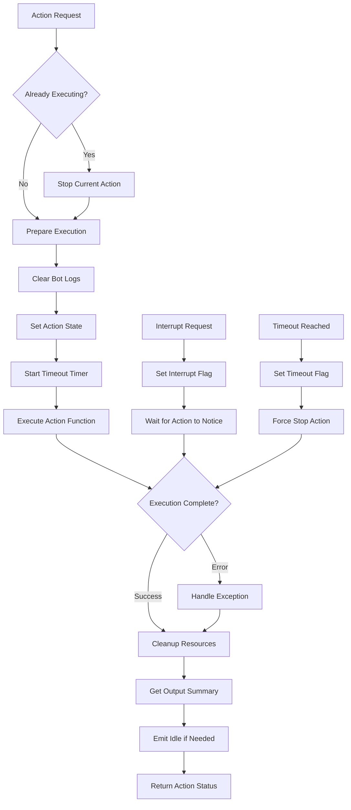

# action_manager.js

## Overview
`action_manager.js` provides a crucial control system for managing the execution of agent actions in the Mindcraft system. It handles action lifecycle, timeouts, interrupts, and error handling to ensure reliable operation of agents in the Minecraft environment.

## Key Components

### Class: ActionManager
The main class responsible for executing, managing, and controlling agent actions.

#### Important Methods:
- `constructor(agent)`: Initializes the action manager with an agent reference
- `runAction(actionLabel, actionFn, options)`: Executes an action with optional timeout and resume capabilities
- `resumeAction(actionFn, timeout)`: Resumes a previously paused action
- `stop()`: Stops the currently executing action with proper cleanup
- `cancelResume()`: Cancels any pending resume operations
- `_executeAction(actionLabel, actionFn, timeout)`: Internal method for action execution with full lifecycle management
- `_executeResume(actionLabel, actionFn, timeout)`: Internal method to handle resumable actions
- `_getBotOutputSummary()`: Formats the bot output for reporting
- `_startTimeout(TIMEOUT_MINS)`: Sets up a timeout for long-running actions

## Process Flow



## Action Execution States
The action manager tracks several important states:
- `executing`: Whether an action is currently running
- `currentActionLabel`: Name/label of the currently running action
- `currentActionFn`: Reference to the currently executing function
- `timedout`: Whether the current action has exceeded its timeout
- `resume_func`: Function to resume if interrupted
- `resume_name`: Name of the resumable action

## Safety Features
1. **Timeout Management**: Prevents actions from running indefinitely
2. **Interrupt Handling**: Allows actions to be safely stopped
3. **Error Capturing**: Comprehensive error handling with stack traces
4. **Output Limiting**: Prevents excessive output from overloading the system
5. **Forced Termination**: Last resort kill mechanism for unresponsive actions

## Dependencies
The action manager works closely with other components:
- Agent's `requestInterrupt()` method for stopping actions
- Agent's `clearBotLogs()` method for log management
- Agent's event system for signaling state changes

## Usage Example
```javascript
// Running a simple action
const result = await agent.actions.runAction('moveToTree', async () => {
  await skills.goToNearestBlock(bot, 'log', 2);
});

// Running an action with timeout
const result = await agent.actions.runAction('buildHouse', buildHouseFunction, { 
  timeout: 20 // 20 minute timeout 
});

// Running a resumable action
const result = await agent.actions.runAction('followPlayer', followFunction, { 
  resume: true
});
```
