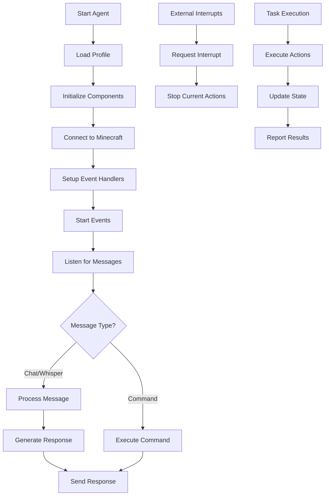

# agent.js

## Overview
`agent.js` serves as the core controller for AI agents in the Mindcraft system. It initializes and manages all the components needed for an agent to function in the Minecraft environment, including communication, memory, actions, and interactions.

## Key Components

### Class: Agent
The main class that orchestrates all agent functionality.

#### Important Methods:
- `start(profile_fp, load_mem, init_message, count_id, task_path, task_id)`: Initializes the agent with a specific profile and optional parameters
- `_setupEventHandlers(save_data, init_message)`: Configures event listeners for chat, whispers, and other Minecraft events
- `handleMessage(username, message, retries)`: Processes incoming messages from players or the system
- `getResponse(username, message)`: Generates a response to a message using the configured LLM
- `startEvents()`: Activates event listeners and recurring processes
- `shutUp()`, `requestInterrupt()`, `clearBotLogs()`: Utility methods to control agent behavior

## Process Flow



## Dependencies
- `History`: Manages conversation history
- `Coder`: Handles code generation and execution
- `Prompter`: Manages LLM prompts and responses
- `ActionManager`: Controls the agent's actions in Minecraft
- `NPCController`: Manages NPC-specific behaviors
- `MemoryBank`: Stores and retrieves agent memories
- `SelfPrompter`: Allows the agent to prompt itself
- `Task`: Manages structured tasks for the agent

## Connection Points
The agent connects to:
1. **Minecraft server** via the mineflayer bot
2. **LLM models** through the prompter
3. **Other agents** via the conversation manager
4. **External systems** through the server proxy

## Key Behaviors
- Responds to player messages with contextually relevant replies
- Executes Minecraft commands and actions
- Manages its own memory and learning
- Follows tasks and goals
- Maintains coherent conversations

## Usage Example
```javascript
const agent = new Agent();
await agent.start('profiles/builder.json', false, 'Hello! I am ready to help with building.', 0);
```
