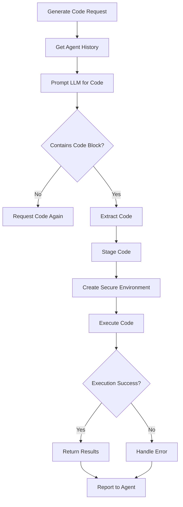

# coder.js

## Overview
`coder.js` enables AI agents to generate, execute, and manage JavaScript code within the Minecraft environment. It provides a secure execution environment for agent-generated code and handles the lifecycle of code execution from generation to evaluation.

## Key Components

### Class: Coder
The main class responsible for code generation, execution, and management.

#### Important Methods:
- `constructor(agent)`: Initializes the coder with references to the agent and sets up necessary file paths
- `lintCode(code)`: Analyzes code for potential issues (currently minimal implementation)
- `stageCode(code)`: Prepares code for execution by sanitizing it and creating a secure execution environment
- `sanitizeCode(code)`: Removes unnecessary prefixes and cleans up the code
- `generateCode(agent_history)`: Primary method to generate and execute code based on agent history
- `generateCodeLoop(agent_history)`: Core loop that handles code generation, validation, and execution
- `writeFilePromise(filename, src)`: Utility to asynchronously write code to files

## Process Flow



## Execution Environment
The code uses a secure compartment system that restricts what agent-generated code can access:

- Access to `skills` module: Provides controlled abilities within Minecraft
- Access to `world` module: Allows inspection and interaction with the Minecraft world
- Access to `Vec3`: For position manipulation
- Access to `log`: For output to the agent's console

## Code Safety Features
1. **Sandboxed Execution**: Using compartments to restrict code access
2. **Interrupt Checks**: Code execution can be interrupted by the agent
3. **File Management**: Generated code is saved to agent-specific directories
4. **Error Handling**: Comprehensive error capture and reporting

## Dependencies
- `fs`: File system operations
- `./library/lockdown.js`: Provides the secure compartment system
- `./library/skills.js`: Minecraft interaction abilities
- `./library/world.js`: World inspection and interaction
- `Vec3`: Position and vector manipulation
- `ESLint`: Code quality checking (currently minimal implementation)

## Usage Example
```javascript
const codeResult = await agent.coder.generateCode(agent.history);
console.log(codeResult);
```

## Files Generated
- Code execution files: `/bots/[agent_name]/action-code/[counter].js`
- Each execution creates a new file with incremental numbering
