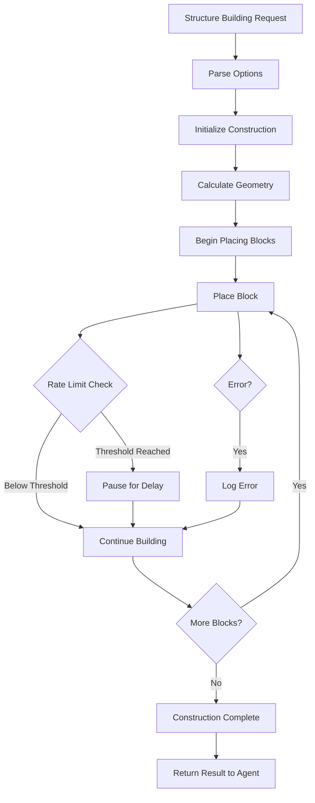

# construction_helpers.js

## Overview
`construction_helpers.js` provides specialized functions for building complex and elaborate structures in Minecraft. It implements rate-limiting mechanisms and error handling to ensure reliable construction without disconnections or failures, allowing AI agents to create sophisticated architectural features.

## Key Functions

### buildSpiral(bot, options)
Creates a spiral structure with customizable parameters.

#### Parameters:
- `bot`: The Minecraft bot instance
- `options`: Configuration object including:
  - `startPosition`: Starting position for the build (default: bot's current position)
  - `height`: Total height of the spiral (default: 10)
  - `radiusStart`: Starting radius at the bottom (default: 3)
  - `radiusEnd`: Ending radius at the top (default: 5)
  - `blockTypes`: Array of block types to alternate (default: ['stone', 'cobblestone'])
  - `blocksPerStep`: How many blocks to place before pausing (default: 10)
  - `delayBetweenSteps`: Milliseconds to wait between steps (default: 10)

### buildTornado(bot, options)
Creates a tornado-like structure with customizable parameters.

#### Parameters:
- `bot`: The Minecraft bot instance
- `options`: Configuration object including:
  - `startPosition`: Starting position for the tornado (default: bot's current position)
  - `height`: Height of the tornado in blocks (default: 50)
  - `baseRadius`: Starting radius at the bottom (default: 5)
  - `topRadius`: Ending radius at the top (default: 10)
  - `blockTypes`: Block types to use (default: ['glowstone', 'verdant_froglight'])
  - `offsetIncrement`: How much to offset each layer (default: 1)
  - `offsetRepeat`: How many times to repeat offset pattern (default: 10)
  - `blocksPerStep`: How many blocks to place before pausing (default: 5)
  - `delayBetweenSteps`: Milliseconds to wait between steps (default: 10)

## Process Flow



## Safety Features

1. **Rate Limiting**: Implements pause mechanisms to prevent overloading the server
   - `blocksPerStep`: Controls how many blocks are placed before pausing
   - `delayBetweenSteps`: Controls pause duration between block groups

2. **Error Handling**: Catches and logs errors without aborting the entire construction
   - Continues to the next block when placement fails
   - Provides progress updates to track completion

3. **Progress Reporting**: Communicates build progress through chat messages
   - Percentage complete updates
   - Start and completion notifications

## Dependencies
- `Vec3`: For position and coordinate manipulation
- `./skills.js`: Uses the `placeBlock` function for actual block placement

## Integration with Skills
The helpers integrate with the main skills module, extending its capabilities for complex building tasks:
- Called by `skills.buildStructure()`
- Provides a higher-level abstraction for architectural features

## Usage Example
```javascript
// Build a spiral staircase
await constructionHelpers.buildSpiral(bot, {
  height: 20,
  radiusStart: 3,
  radiusEnd: 3,
  blockTypes: ['stone_bricks', 'mossy_stone_bricks']
});

// Build a tornado
await constructionHelpers.buildTornado(bot, {
  height: 40,
  baseRadius: 3,
  topRadius: 8,
  blockTypes: ['obsidian', 'crying_obsidian']
});
```
