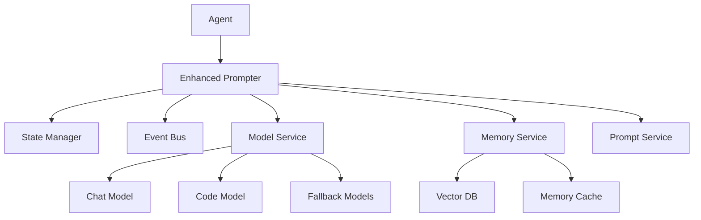
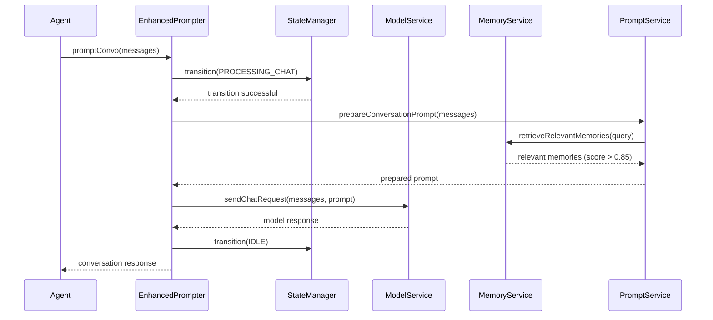
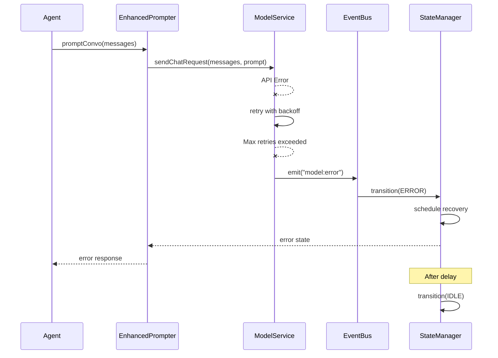

# Enhanced Prompter System

## Overview

The Enhanced Prompter System is a robust, service-oriented architecture designed to replace the original monolithic `prompter.js` implementation. It addresses reliability issues, reduces disconnections, and implements efficient design patterns while maintaining backward compatibility with the existing API.

The system features comprehensive error handling, connection management, memory caching, and state management to ensure stable performance even under challenging network conditions.

## Architecture

The Enhanced Prompter follows a service-oriented architecture with clear separation of concerns:



## Core Components

### EnhancedPrompter

`EnhancedPrompter` is the main class that orchestrates the other services. It maintains backward compatibility with the original `Prompter` API while leveraging the improved infrastructure for reliability.

Key responsibilities:
- Initialize and coordinate services
- Load agent profiles
- Manage backward compatibility
- Handle high-level operations like conversation, coding, and memory management

### StateManager

`StateManager` implements a finite state machine that governs the system's behavior:

**States:**
- `IDLE`: Ready to process new requests
- `PROCESSING_CHAT`: Handling a conversation request
- `PROCESSING_CODE`: Generating code
- `PROCESSING_MEMORY`: Storing or retrieving memories
- `ERROR`: Error state with automatic recovery
- `COOLDOWN`: Waiting for cooldown period

The state machine ensures that operations occur in the correct sequence and prevents invalid state transitions, increasing stability and preventing deadlocks.

### EventBus

`EventBus` provides a decoupled communication mechanism between services. Services can publish events and subscribe to events from other components without direct dependencies.

Common events:
- `model:error`: Emitted when a model encounters an error
- `memory:stored`: Emitted when a memory is successfully stored
- `state:changed`: Emitted when the prompter state changes

### ModelService

`ModelService` manages connections to language models with enhanced reliability features:

- **Connection Pooling**: Maintains a pool of connections to reduce connection overhead
- **Automatic Retries**: Implements exponential backoff retry logic
- **Fallback Models**: Allows defining fallback models when primary models fail
- **Health Checks**: Monitors model endpoint health to detect issues proactively
- **Request Timeouts**: Prevents operations from hanging indefinitely

### MemoryService

`MemoryService` provides enhanced memory operations with performance optimizations:

- **Memory Caching**: Reduces redundant vector searches for frequent queries
- **High Relevance Threshold**: Enforces a minimum relevance score of 0.85 for memory retrieval
- **Timeout Protection**: Prevents hanging on slow memory operations
- **Graceful Degradation**: Falls back to simpler retrieval when vector search fails

### PromptService

`PromptService` handles prompt preparation and template variable replacement:

- **Template Management**: Processes prompt templates from agent profiles
- **Variable Replacement**: Handles system variables like `$NAME`, `$STATS`, etc.
- **Error Resilience**: Continues operation even if some replacements fail

## Process Flows

### Conversation Flow



### Error Handling Flow



## Memory Retrieval System

The memory retrieval system has been optimized for relevance and performance:

1. **High Relevance Filtering**: Only memories with a relevance score above 0.85 are returned
2. **Two-Level Caching**:
   - Recent queries are cached to avoid redundant vector searches
   - Results are cached with a 60-second TTL (Time To Live)
3. **Invalidation Strategy**:
   - Cache entries are invalidated when related new memories are created
   - Cache is cleared completely when memories are deleted

## Error Handling and Recovery

The system implements a comprehensive error handling strategy:

1. **Detection**: Errors are caught at multiple levels
2. **Containment**: Errors are isolated to affected components
3. **Recovery**:
   - Automatic retry with exponential backoff for transient errors
   - Fallback to alternative models when primary models fail
   - Automatic state recovery after error conditions
4. **Reporting**: Detailed error logging for diagnosis

## Customization Options

The Enhanced Prompter can be customized through several configuration points:

1. **Model Configuration**:
   - Primary/fallback model pairs
   - Retry counts and backoff factors
   - Request timeouts

2. **Memory System**:
   - Relevance threshold (default: 0.85)
   - Cache TTL (default: 60 seconds)
   - Maximum result count

3. **State Management**:
   - Custom state transitions
   - State transition callbacks

## API Compatibility

The Enhanced Prompter maintains backward compatibility with the original Prompter API:

```javascript
// Original usage
import { Prompter } from './src/models/prompter.js';
const prompter = new Prompter(agent, profilePath);

// Enhanced usage with adapter
import { createPrompter } from './src/models/prompter_adapter.js';
const prompter = createPrompter(agent, profilePath);
```

## Performance Considerations

The Enhanced Prompter is designed for improved performance:

1. **Reduced API Calls**:
   - Memory caching reduces vector search requests
   - Connection pooling reduces connection overhead

2. **Optimized Resource Usage**:
   - Timeouts prevent resource leaks
   - State management prevents concurrent operations

3. **Scalability**:
   - Service-oriented architecture allows for independent scaling
   - Event-based communication reduces tight coupling

## Implementation and Migration

To implement the Enhanced Prompter:

1. Add the new service files to your project
2. Use the adapter for a gradual transition
3. Monitor performance and stability
4. Fully migrate by replacing the original implementation

Refer to the `MIGRATION_GUIDE.md` for detailed migration steps.

## Advanced Features

### Health Monitoring

The system provides health monitoring features:

```javascript
// Check if the prompter is in an error state
if (prompter.hasError()) {
  console.warn('Prompter is in error state');
}

// Get the current state
const state = prompter.getState();

// Reset the prompter if needed
prompter.reset();
```

### Event Listeners

You can register custom event listeners:

```javascript
// Listen for memory storage events
prompter.eventBus.on('memory:stored', (memory) => {
  console.log('New memory stored:', memory.id);
});

// Listen for state transitions
prompter.stateManager.onTransition('idle', (fromState) => {
  console.log(`Transitioned to idle from ${fromState}`);
});
```

## Conclusion

The Enhanced Prompter System offers significant improvements in reliability, performance, and maintainability while preserving the behavior and API of the original implementation. The service-oriented architecture makes the system more resilient to failures and easier to extend with new capabilities.
