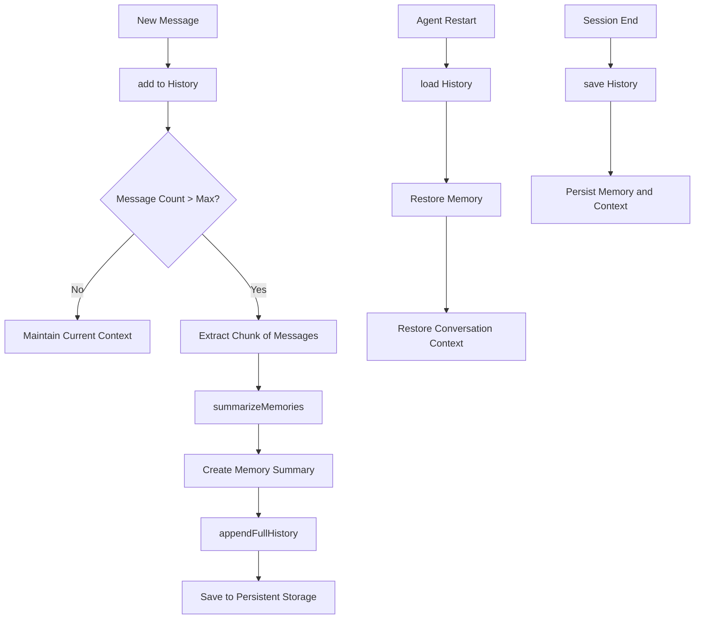

# history.js

## Overview
`history.js` manages conversation history and memory for agents in the Mindcraft system. It handles storing, summarizing, and retrieving conversations, allowing agents to maintain context over extended interactions and persist memories between sessions.

## Key Components

### Class: History
The main class responsible for managing conversation history and memory.

#### Important Methods:
- `constructor(agent)`: Initializes the history manager with an agent reference
- `getHistory()`: Returns a deep copy of the current conversation turns
- `summarizeMemories(turns)`: Creates a condensed memory from conversation turns
- `appendFullHistory(to_store)`: Saves conversation chunks to a persistent history file
- `add(name, content)`: Adds a new message to the conversation history
- `save()`: Persists the current memory and conversation state to disk
- `load()`: Loads previously saved memory and conversation state from disk
- `clear()`: Resets the conversation history and memory

## Process Flow



## Memory Management
The history system implements a smart memory management approach:
1. **Short-term memory**: Recently added messages in `turns` array
2. **Long-term memory**: Summarized version of older messages in `memory` string
3. **Archival storage**: Complete conversation logs in dated history files

## Configuration Parameters
- `max_messages`: Maximum number of turns to keep in active context
- `summary_chunk_size`: Number of messages to summarize at once
- Memory summary maximum is capped at 500 characters

## File Structure
The history manager creates and manages several file paths:
- `./bots/${name}/memory.json`: Current memory and context state
- `./bots/${name}/histories/${timestamp}.json`: Full conversation archive files

## Integration Points
- Works with the agent's prompter to create memory summaries
- Stores the agent's self-prompter state
- Records the agent's last conversation partner

## Usage Example
```javascript
// Add a new message to history
await agent.history.add('user123', 'Can you help me build a house?');

// Add agent's own response
await agent.history.add(agent.name, 'Sure! I can help you build a house.');

// Save current state for persistence
await agent.history.save();

// Later, load the saved state
const savedData = agent.history.load();
```
