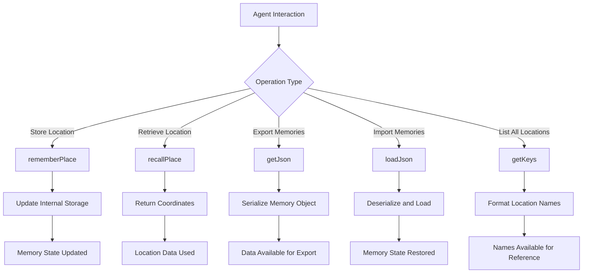

# memory_bank.js

## Overview
`memory_bank.js` implements a simple key-value storage system for agents to remember important locations in the Minecraft world. This lightweight memory system allows agents to store and recall coordinates associated with named locations.

## Key Components

### Class: MemoryBank
A simple storage class for managing location-based memories.

#### Important Methods:
- `constructor()`: Initializes an empty memory storage object
- `rememberPlace(name, x, y, z)`: Stores coordinates with an associated name
- `recallPlace(name)`: Retrieves coordinates for a named location
- `getJson()`: Returns the entire memory object as JSON
- `loadJson(json)`: Loads memories from a JSON object
- `getKeys()`: Returns a comma-separated list of all stored location names

## Process Flow



## Data Structure
The memory bank uses a simple JavaScript object structure:
```javascript
{
  "home": [100, 64, 200],       // [x, y, z] coordinates
  "mine": [50, 30, -100],       // [x, y, z] coordinates
  "village": [300, 70, 500]     // [x, y, z] coordinates
}
```

## Integration
This simple memory system is complementary to the more sophisticated vector-based memory system in the prompter component:
- `memory_bank.js`: Provides simple location-based memory storage
- Vector memory in `prompter.js`: Handles semantic memory storage and retrieval

## Usage Example
```javascript
// Remember the location of a home base
agent.memory_bank.rememberPlace('home_base', 100, 64, 200);

// Recall the location later
const [x, y, z] = agent.memory_bank.recallPlace('home_base');
await skills.goToPosition(bot, x, y, z);

// Check what locations are stored
const locationNames = agent.memory_bank.getKeys();
console.log(`I remember these places: ${locationNames}`);

// Save memories for persistence
const memoryData = agent.memory_bank.getJson();
saveToFile('memories.json', JSON.stringify(memoryData));

// Load memories from file
const loadedData = JSON.parse(readFileSync('memories.json'));
agent.memory_bank.loadJson(loadedData);
```
