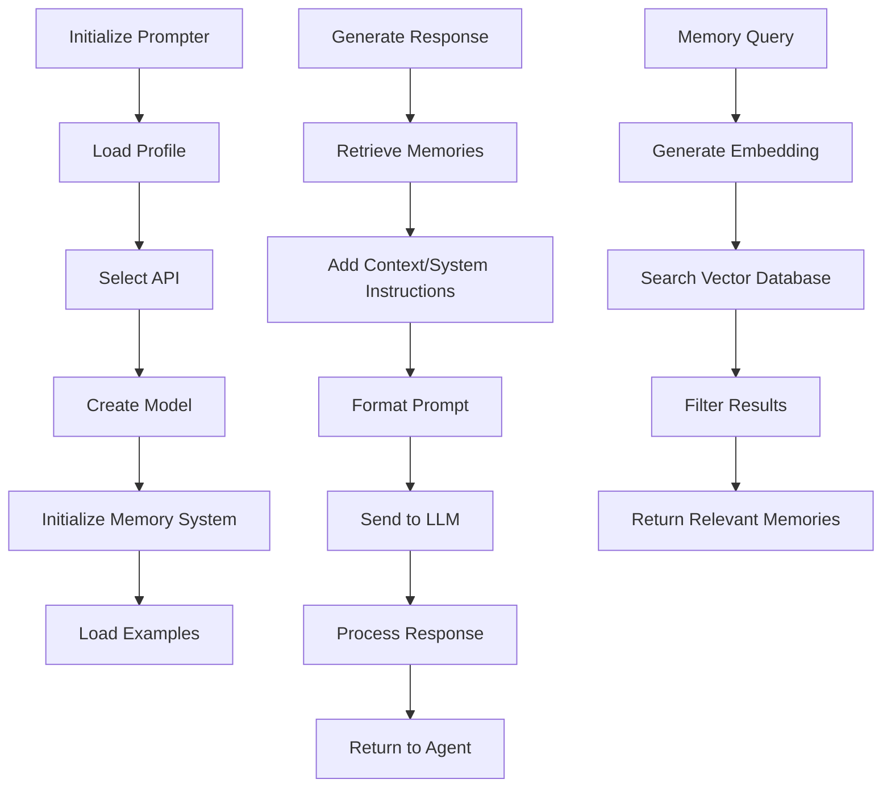

# prompter.js

## Overview
`prompter.js` is a critical component of the Mindcraft system that manages all interactions with language models (LLMs). It handles prompt construction, LLM API integration, embedding generation, and memory retrieval for AI agents in the Minecraft environment.

## Key Components

### Class: Prompter
The main class responsible for managing LLM interactions and memory systems.

#### Important Methods:
- `constructor(agent, fp, memory)`: Initializes the prompter with agent reference, profile filepath, and optional memory
- `_selectAPI(profile)`: Determines the appropriate API to use based on model names and settings
- `_createModel(profile)`: Instantiates the appropriate model API client
- `initExamples()`: Loads conversation and coding examples
- `getName()`: Retrieves the agent's name from profile
- `promptChat(messages)`: Sends conversational prompts to the configured LLM
- `promptCoding(messages)`: Sends code generation prompts to the configured LLM
- `retrieveMemories(query)`: Retrieves relevant memories based on semantic similarity
- `askForSkillDocs(skillNames)`: Gets documentation for specific skills
- `embedText(text)`: Generates embeddings for text using the embedding model

## Process Flow



## Language Model Support
The system supports multiple LLM providers:
- **Google AI** (Gemini models)
- **OpenAI** (GPT models)
- **Anthropic** (Claude models)
- **Mistral AI**
- **Replicate API**
- **Local** (Ollama)
- **Novita**
- **Groq Cloud**
- **HuggingFace**
- **Qwen**
- **Grok**

## Memory System
The prompter integrates with a vector database (Qdrant) to store and retrieve memories:
- Converts text to embeddings for semantic search
- Stores memories with metadata
- Retrieves memories based on relevance to current context
- **Important**: As per user's memory retrieved in a prior session, the memory retrieval system is customized to only use long-term memories when their relevance scores are very high (above 0.85), ensuring that only highly relevant memories are used

## Dependencies
- Various model-specific API clients (Gemini, GPT, Claude, etc.)
- `@qdrant/js-client-rest`: Vector database client
- `MemoryManager`: Manages vector memory storage and retrieval
- `Examples`: Handles example loading for few-shot learning
- `SkillLibrary`: Provides documentation for available skills

## Configuration
The prompter uses a hierarchical configuration system:
1. Default profile (./profiles/defaults/_default.json)
2. Base profile (specified in settings)
3. Individual agent profile (specified during initialization)
Each level can override settings from the previous level.

## Usage Example
```javascript
const prompter = new Prompter(agent, './profiles/BobVilaAI.json');
const response = await prompter.promptChat([
  { role: 'user', content: 'How do I build a house?' }
]);
```
