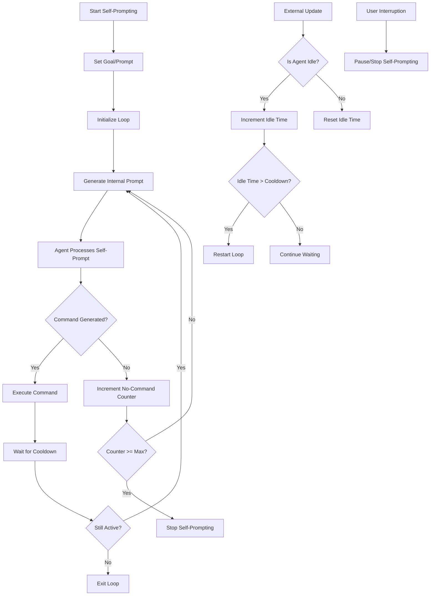

# self_prompter.js

## Overview
`self_prompter.js` implements an autonomous self-prompting system that enables agents to maintain goal-directed behavior without continuous user input. This allows agents to pursue tasks autonomously by internally generating prompts and commands.

## Key Components

### Class: SelfPrompter
The main class responsible for the agent's autonomous goal-driven behavior.

#### States:
- `STOPPED (0)`: Self-prompting is inactive
- `ACTIVE (1)`: Self-prompting is running
- `PAUSED (2)`: Self-prompting is temporarily paused but can be resumed

#### Important Methods:
- `constructor(agent)`: Initializes the self-prompter with an agent reference
- `start(prompt)`: Begins the self-prompting loop with a specific goal
- `startLoop()`: Core method that manages the ongoing self-prompting process
- `handleLoad(prompt, state)`: Restores a saved self-prompting state
- `update(delta)`: Manages self-prompting based on agent idle time
- `stop(stop_action)`: Completely stops self-prompting
- `pause()`: Temporarily pauses self-prompting
- `isActive()`, `isStopped()`, `isPaused()`: State check methods
- `shouldInterrupt(is_self_prompt)`: Determines if a self-prompt should be interrupted
- `handleUserPromptedCmd(is_self_prompt, is_action)`: Handles user interruptions

## Process Flow



## Self-Prompting Flow
1. Agent receives a goal through the `start(prompt)` method
2. Agent begins autonomously generating internal prompts with the format:
   ```
   You are self-prompting with the goal: '[goal]'. 
   Your next response MUST contain a command with this syntax: !commandName. 
   Respond:
   ```
3. The agent processes these internal prompts and generates commands
4. If the agent fails to generate commands for a specific number of consecutive attempts (MAX_NO_COMMAND), self-prompting stops

## Safety Features
1. **No-Command Detection**: Stops if agent repeatedly fails to generate actionable commands
2. **Interrupt Handling**: Can be interrupted when user sends new commands
3. **Cooldown Period**: Prevents rapid-fire self-prompting
4. **State Management**: Cleanly handles transitions between states

## Integration Points
- Works with the agent's `handleMessage()` method to process internal prompts
- Coordinates with `ActionManager` to manage ongoing actions
- Uses the agent's idle detection to determine when to restart self-prompting

## Usage Example
```javascript
// Start agent on a task to build a house
agent.self_prompter.start("Build a wooden house with a sloped roof near my position");

// Pause self-prompting temporarily
await agent.self_prompter.pause();

// Resume from previous state
agent.self_prompter.state = ACTIVE;

// Stop self-prompting completely
await agent.self_prompter.stop();
```
