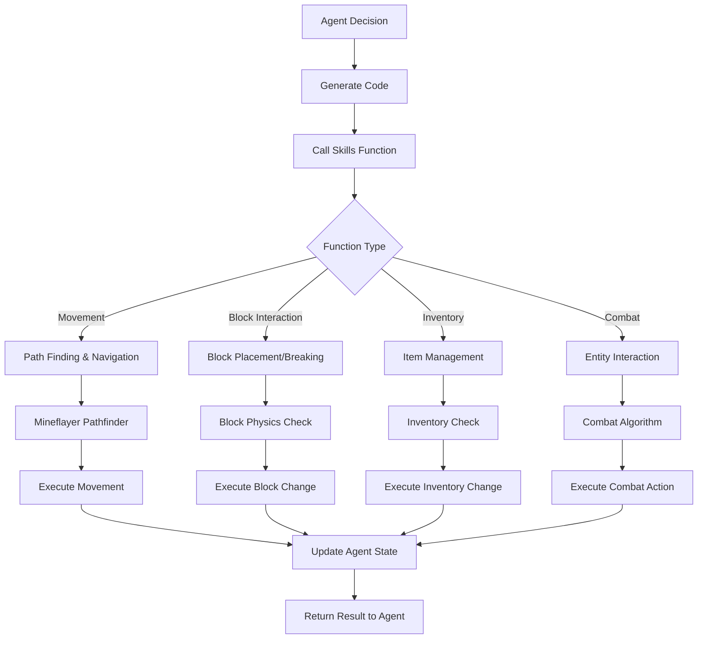

# skills.js

## Overview
`skills.js` provides a comprehensive library of functions that enable AI agents to interact with the Minecraft world. It serves as the primary interface between agent code and the Minecraft environment, offering capabilities for movement, building, combat, inventory management, and more.

## Key Functions

### Crafting & Resource Management
- `craftRecipe(bot, itemName, num)`: Crafts items from available resources
- `smeltItem(bot, itemName, num)`: Smelts items in a furnace
- `clearNearestFurnace(bot)`: Clears items from the nearest furnace

### Combat & Defense
- `attackNearest(bot, mobType, kill)`: Attacks the nearest entity of specified type
- `attackEntity(bot, entity, kill)`: Attacks a specific entity
- `defendSelf(bot, range)`: Defends against nearby hostile entities
- `avoidEnemies(bot, distance)`: Moves away from hostile entities

### Block Interaction
- `collectBlock(bot, blockType, num, exclude)`: Collects specified blocks
- `breakBlockAt(bot, x, y, z)`: Breaks a block at specific coordinates
- `placeBlock(bot, blockType, x, y, z, placeOn, dontCheat)`: Places a block at coordinates

### Inventory Management
- `equip(bot, itemName)`: Equips specified item
- `discard(bot, itemName, num)`: Discards items from inventory
- `putInChest(bot, itemName, num)`: Puts items in a chest
- `takeFromChest(bot, itemName, num)`: Takes items from a chest
- `viewChest(bot)`: Views contents of a nearby chest
- `consume(bot, itemName)`: Consumes food or potion

### Movement & Navigation
- `goToPosition(bot, x, y, z, min_distance)`: Moves to specific coordinates
- `goToNearestBlock(bot, blockType, min_distance, range)`: Moves to nearest block of type
- `goToNearestEntity(bot, entityType, min_distance, range)`: Moves to nearest entity
- `goToPlayer(bot, username, distance)`: Moves to specific player
- `followPlayer(bot, username, distance)`: Continuously follows a player
- `moveAway(bot, distance)`: Moves away from current position
- `moveAwayFromEntity(bot, entity, distance)`: Moves away from entity
- `stay(bot, seconds)`: Stays in current position for specified time

### World Interaction
- `useDoor(bot, door_pos)`: Opens or closes a door
- `goToBed(bot)`: Finds and uses a bed
- `tillAndSow(bot, x, y, z, seedType)`: Tills soil and plants seeds
- `activateNearestBlock(bot, type)`: Activates nearest block of specified type
- `log(bot, message)`: Outputs message to the agent's log

### Advanced Building
- `buildStructure(bot, structureType, options)`: Builds complex structures using construction helpers

## Process Flow

## Helper Functions
The module includes several internal helper functions:
- `delayCommand()`: Adds delay between commands to prevent server overload
- `safeCommandExecute()`: Safely executes commands with proper timing
- `throttledBlockOperation()`: Throttles batch operations to prevent disconnections
- `autoLight()`: Automatically places torches when needed
- `equipHighestAttack()`: Equips the most effective weapon for combat

## Safety Features
1. **Rate Limiting**: Prevents server overload and disconnections
2. **Error Handling**: Graceful failure with informative messages
3. **Inventory Checks**: Verifies resources before attempting actions
4. **Interrupt Handling**: Allows actions to be interrupted

## Dependencies
- `../../utils/mcdata.js`: Minecraft data utilities
- `./world.js`: World inspection and state utilities
- `mineflayer-pathfinder`: Navigation capabilities
- `vec3`: Position and vector manipulation
- `./construction_helpers.js`: Advanced structure building

## Integration with Construction Helpers
The skills module integrates with `construction_helpers.js` to enable building complex structures like:
- Spirals
- Tornados
- Other advanced architectural features
