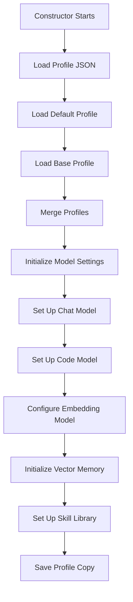
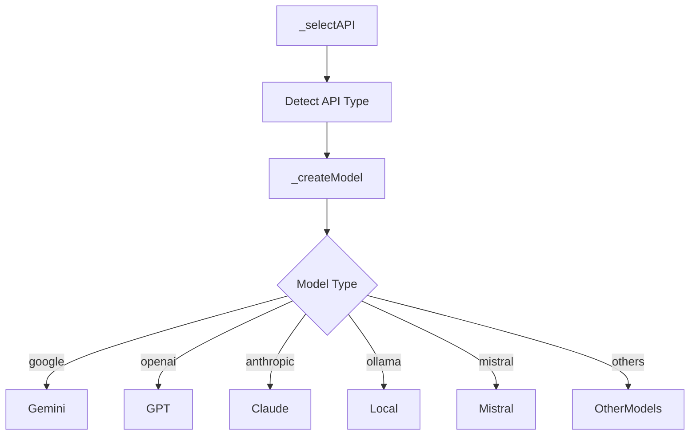
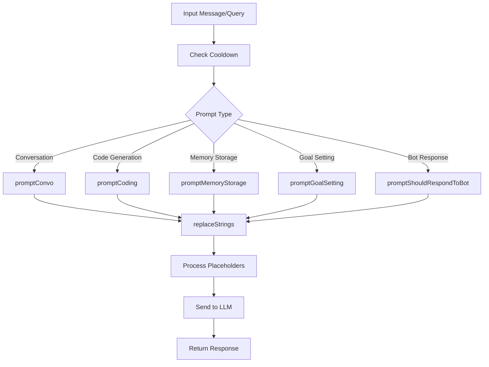
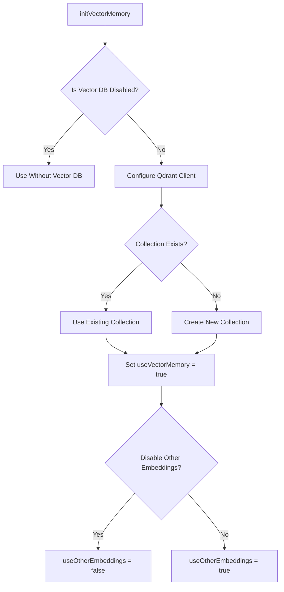
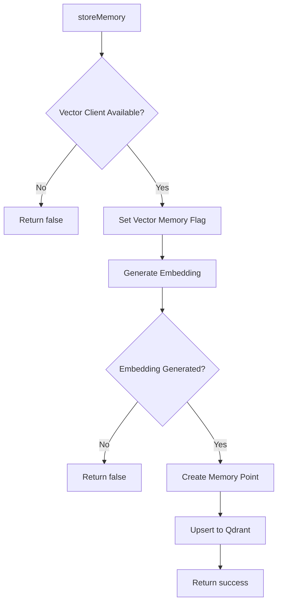
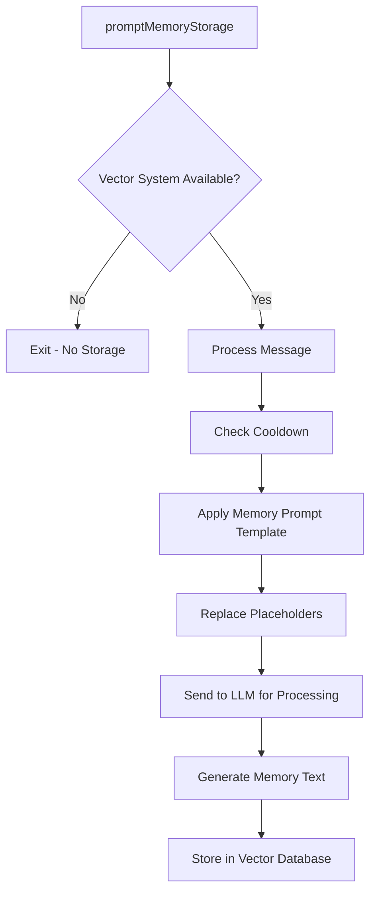

# Prompter.js Workflow and Architecture

## Overview

The `prompter.js` file is a central component responsible for:
1. Initializing language models
2. Processing prompts
3. Managing conversations
4. Handling examples
5. Implementing the vector-based memory system

This document provides a visual map of how `prompter.js` works to help you understand its architecture and identify possible modification points.

## Initialization Flow



### Profile Hierarchy
1. **Default Profile**: Base configuration from `./profiles/defaults/_default.json`
2. **Base Profile**: Configuration from the path in `settings.base_profile`
3. **Individual Profile**: Specific agent profile passed to constructor
4. **Precedence**: Individual > Base > Default (later profiles override earlier ones)

## Model Selection & Creation

### API Selection Logic
1. Parses model string or profile object
2. Auto-detects API based on model name patterns:
   - `gemini` → Google
   - `gpt` → OpenAI
   - `claude` → Anthropic
   - etc.
3. Allows explicit API override via `profile.api`

### Model Initialization
Creates appropriate model instance based on API type:


## Prompt Processing Workflow



### Key Placeholder Replacement Logic
`replaceStrings` handles various placeholders:
- `$NAME`: Agent name
- `$STATS`, `$INVENTORY`, `$ACTION`: Agent state
- `$COMMAND_DOCS`, `$CODE_DOCS`: Documentation
- `$EXAMPLES`: Relevant examples
- `$MEMORY`: Short-term memory
- `$CONVO`: Recent conversation
- `$LONG_TERM_MEMORY`: Vector-based memories (discussed below)
- Others: `$SELF_PROMPT`, `$TO_SUMMARIZE`, `$LAST_GOALS`, `$BLUEPRINTS`, `$EXPERIENCE`

## Vector Memory System

### Initialization Process


### Memory Storage Flow


### Memory Retrieval Process
```mermaid
graph TD
    A[retrieveRelevantMemories] --> B{Vector Client Available?}
    B -->|No| C[Return "No memory system"]
    B -->|Yes| D[Generate Query Embedding]
    D --> E{Embedding Generated?}
    E -->|No| F[Return error message]
    E -->|Yes| G[Search Vector Collection]
    G --> H{Results Found?}
    H -->|No| I[Return "No memories found"]
    H -->|Yes| J[Filter for High Relevance]
    J --> K{High Relevance Results?}
    K -->|No| L[Check Top Result]
    K -->|Yes| M[Format Relevant Memories]
    L --> N{Score > 0.7?}
    N -->|Yes| O[Return Top Result]
    N -->|No| P[Return "No highly relevant memories"]
    M & O --> Q[Return Formatted Results]
```

### Custom Relevance Threshold
**Current Setting**: The system is configured to only use long-term memories when their relevance scores are very high (above 0.85). This ensures that the agent only uses memories that are highly relevant to the current context.

```javascript
// Define a high relevance threshold
const HIGH_RELEVANCE_THRESHOLD = 0.85;
            
// Filter for only highly relevant results
const highlyRelevantResults = searchResults.filter(result => result.score >= HIGH_RELEVANCE_THRESHOLD);
```

## Interactive Memory Processing

### Memory Storage from Messages


## Possible Modification Points

1. **Relevance Threshold**: Currently set at 0.85 in `retrieveRelevantMemories()` - adjust to control memory sensitivity
2. **Memory Format**: Modify the memory formatting in the same function
3. **Embedding Models**: Change or enhance in the constructor
4. **Memory Storage Logic**: Customize the `promptMemoryStorage` function to change how experiences are processed into memories
5. **Vector DB Settings**: Update Qdrant configuration in `initVectorMemory()`
6. **Memory Context**: Modify the `$LONG_TERM_MEMORY` replacement in `replaceStrings()`
7. **Additional Memory Types**: Implement new memory types with dedicated storage/retrieval paths
8. **Memory Importance**: Enhance the metadata in `storeMemory()` for better filtering

## Integration Points

The memory system integrates with the rest of the system through:
1. The `replaceStrings()` function that places memories into prompts
2. The agent's history that might trigger memory storage
3. The `$LONG_TERM_MEMORY` placeholder in profile templates
4. The skills library that uses the same embedding model

## Conclusion

The prompter.js file manages a sophisticated system of model initialization, prompt processing, and memory management. The vector-based memory system provides long-term recall capabilities, with relevance filtering ensuring only highly appropriate memories are used in context.
